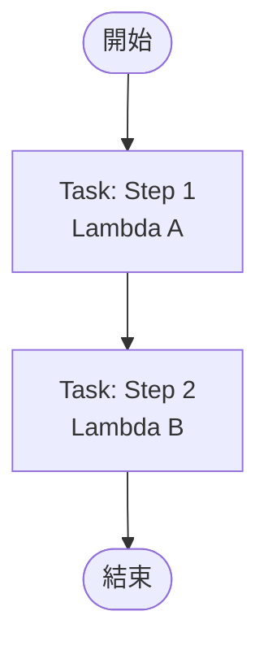
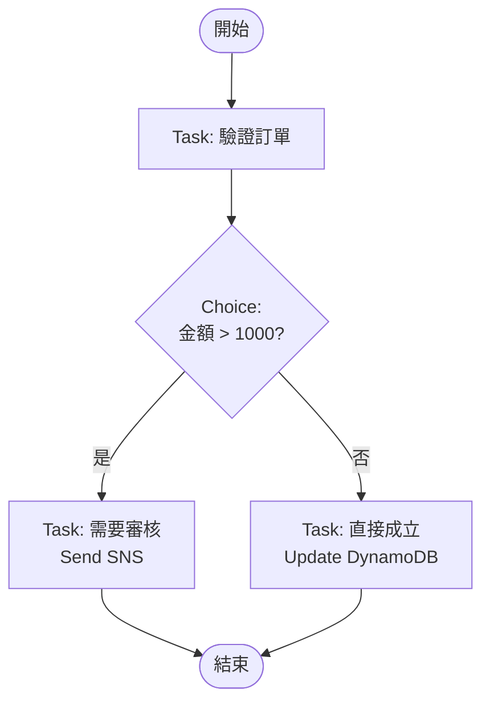
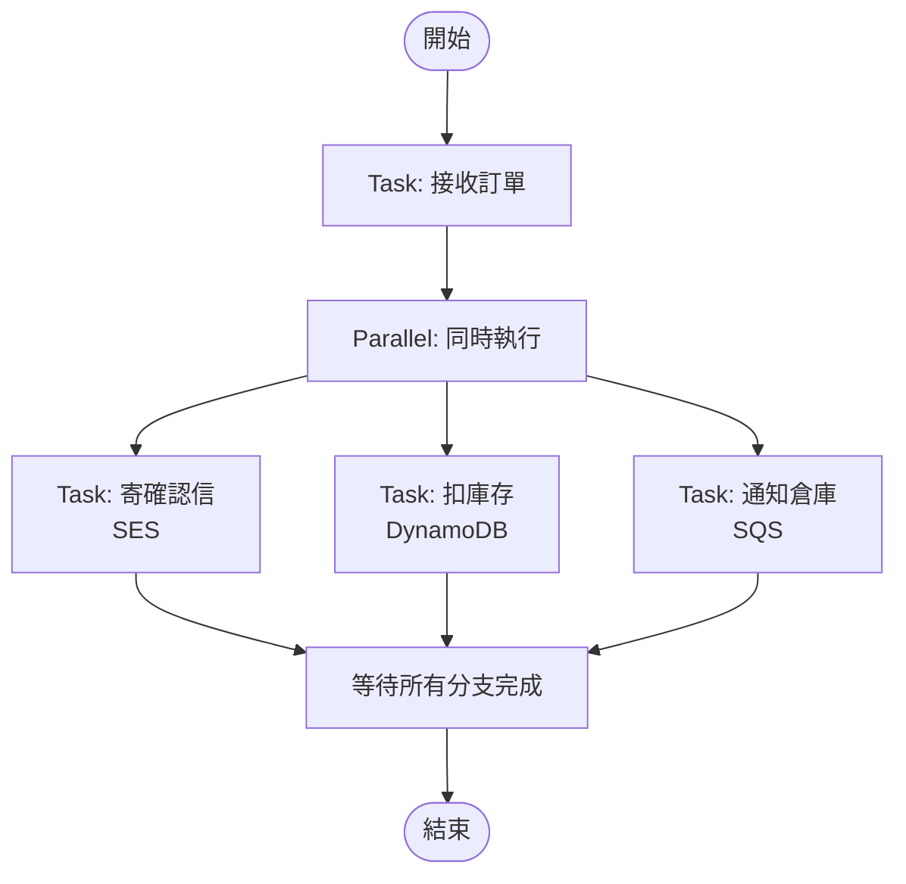
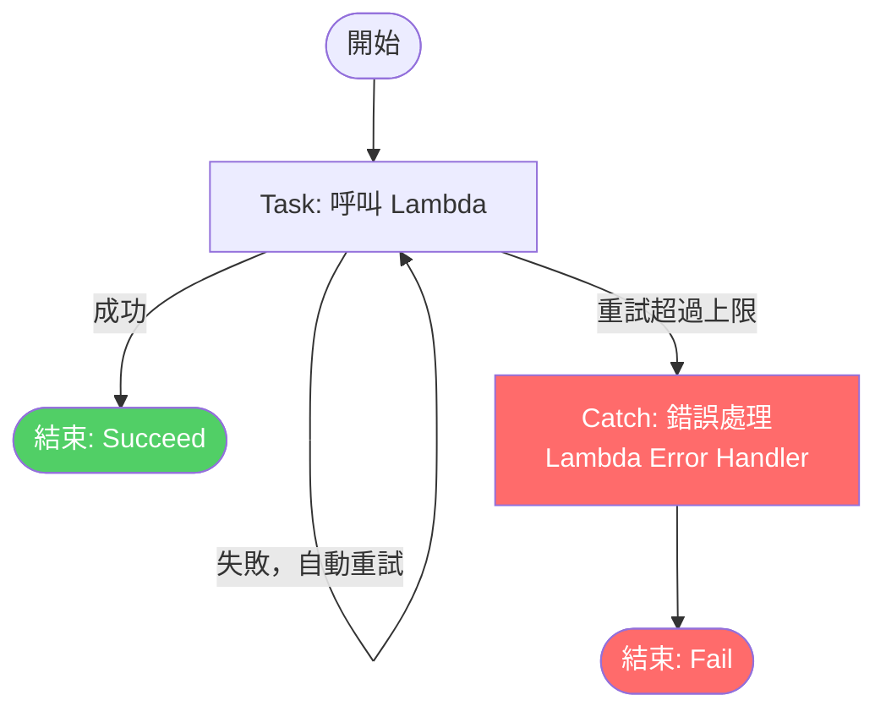
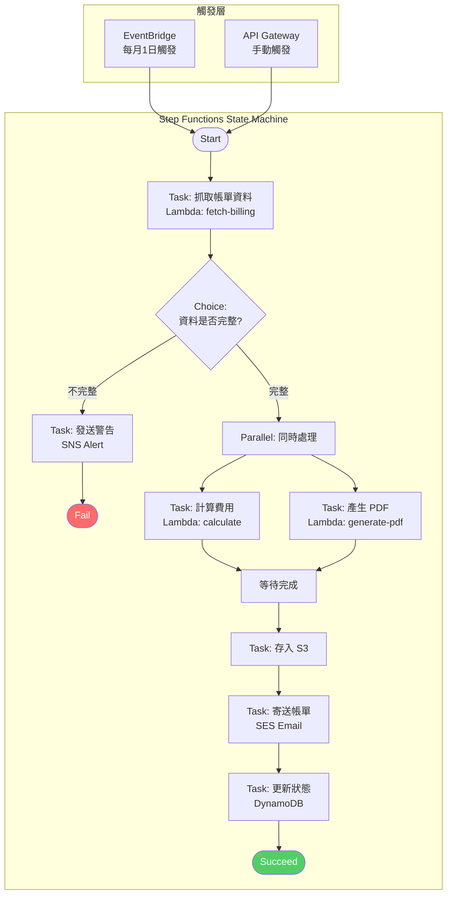
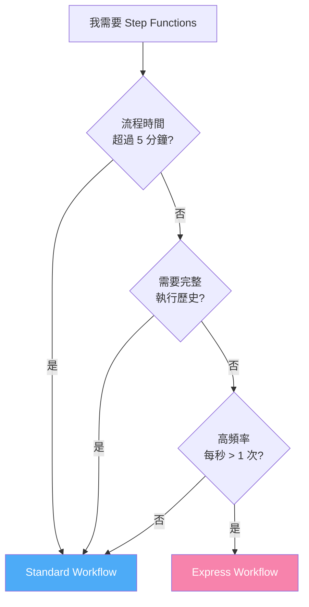

# AWS Step Functions

## 1. 是什麼？（What）

- AWS Step Functions 是一個**無伺服器的工作流程編排服務**
- 讓你把多個 AWS 服務（Lambda、ECS、SNS、DynamoDB 等）串接成一個**有順序、有邏輯的工作流程**
- 工作流程用 **ASL（Amazon States Language）** 定義，格式為 JSON
- 視覺化介面可以直接看到每個步驟的執行狀態

---

## 2. 為什麼要用它？（Why）

### 問題背景：沒有 Step Functions 之前
- 多個 Lambda 互相呼叫 → 程式碼裡硬寫流程邏輯
- 錯誤處理、重試邏輯分散在各個函數裡
- 難以追蹤「現在跑到哪一步」、「哪一步失敗了」
- 流程一複雜，程式碼就變成義大利麵

### Step Functions 解決了什麼
- **流程邏輯與業務邏輯分離**：Lambda 只負責做事，Step Functions 負責決定順序
- **內建錯誤處理與重試**：不用自己寫 try/catch 串接邏輯
- **視覺化監控**：AWS Console 直接看到每個 state 的輸入輸出
- **狀態持久化**：執行中途失敗可以從失敗點重試，不用從頭來

### 什麼時候該用？
- 需要**多步驟、有條件分支**的流程（if/else、parallel）
- 需要**長時間執行**的流程（最長可等待 1 年）
- 需要**人工審核**中間步驟（等待外部事件）
- 微服務之間的**編排（Orchestration）**

---

## 3. 核心概念（Core Concepts）

### State Machine（狀態機）
- 整個工作流程的定義
- 由多個 **State（狀態）** 組成

### State 的類型
| 類型 | 說明 |
|------|------|
| `Task` | 執行一個工作（呼叫 Lambda、ECS 等） |
| `Choice` | 條件判斷，類似 if/else |
| `Parallel` | 同時執行多個分支 |
| `Map` | 對陣列中每個元素執行相同流程 |
| `Wait` | 等待一段時間或特定時間點 |
| `Pass` | 直接傳遞資料，不做任何事 |
| `Succeed` | 成功結束 |
| `Fail` | 失敗結束 |

---

## 4. 圖解（由簡單到複雜）

### 圖解 1：最基本的線性流程



---

### 圖解 2：加入 Choice（條件判斷）



---

### 圖解 3：加入 Parallel（平行執行）



---

### 圖解 4：加入錯誤處理（Retry / Catch）



---

### 圖解 5：完整架構 — Billing Portal 帳單產生流程（實際應用）



---

### 圖解 6：Standard vs Express 選擇流程



---

## 5. 兩種工作流程模式

| 模式 | Standard Workflow | Express Workflow |
|------|-------------------|------------------|
| 執行時間上限 | 1 年 | 5 分鐘 |
| 執行次數計費 | 依狀態轉換次數 | 依執行次數＋時間 |
| 適合場景 | 長流程、需要審核 | 高頻率、短流程 |
| 執行歷史 | 完整保留 | 需搭配 CloudWatch |

---

## 6. 基本 ASL 範例

```json
{
  "Comment": "簡單的兩步驟流程",
  "StartAt": "Step1",
  "States": {
    "Step1": {
      "Type": "Task",
      "Resource": "arn:aws:lambda:ap-northeast-1:123456789:function:my-function",
      "Next": "Step2"
    },
    "Step2": {
      "Type": "Task",
      "Resource": "arn:aws:lambda:ap-northeast-1:123456789:function:my-function-2",
      "End": true
    }
  }
}
```

---

## 7. 費用概念

- **Standard**：每 1,000 次狀態轉換 $0.025
- **Express**：每 1,000,000 次執行 $1.00 + 執行時間費用
- 免費方案：每月 4,000 次狀態轉換（Standard）

---

## 8. 學習重點整理

- [ ] 理解 State Machine 的概念
- [ ] 能夠用 ASL 寫出基本的 Task → Task 流程
- [ ] 知道 Choice state 怎麼做條件判斷
- [ ] 了解 Standard vs Express 的差異與選擇依據
- [ ] 能夠在 AWS Console 建立並執行一個 State Machine

---

## 參考資源

- [AWS Step Functions 官方文件](https://docs.aws.amazon.com/step-functions/)
- [ASL 語法參考](https://docs.aws.amazon.com/step-functions/latest/dg/concepts-amazon-states-language.html)
- [Step Functions Workshop](https://catalog.workshops.aws/stepfunctions/en-US)
